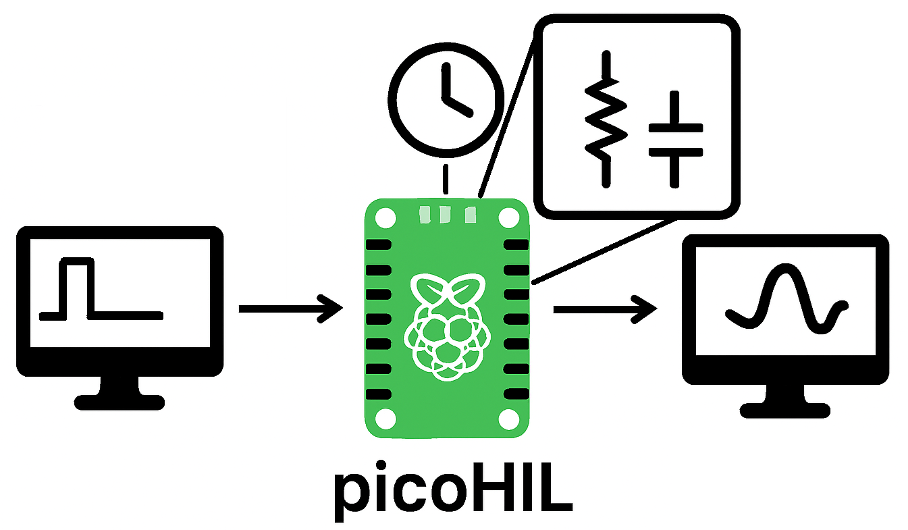

# picoHIL
Raspberry pi pico based Hardware-In-the-Loop. 
 
Este projeto consiste de: 
- Um conjunto de solvers para sistemas lineares do tipo A.x=B
- Um pequeno motor de análise nodal de circuitos (picoSPICE)
- Possibilidade de iteração com o mundo externo através de PWM como DAC e canais ADC para
interação com o circuito.
- Execução em tempo quasi-real do circuito (depende do número de nós e elementos). 
O objetivo é que o microcontrolador emule circuitos internamente, porém iteragindo com o mundo externo. 
A iteração é feita através de: 
- ADCs que servem como fontes de tensão ou corrente, com a respectiva adaptação de faixa de tensão e offset. 
- DACs via PWM+RC que servem para observar a diferença de potencial entre nós ou a corrente nos elementos.
- I/O (essencialmente input) cujo objetivo é acionar interruptores controlados (elementos SWITCH).
O diagrama abaixo exibe a idéia principal: 

# Passo-A-Passo
Para rodar o picoHIL na Raspberry pi PICO:
- Instalar do VS Code + Extensão da Raspberry Pi Pico.
- Importar o projeto.
- Compilar e descarregar na placa. 
Exemplos de uso:
...
...
...

Quaisquer dúvidas: danielbezerra@ifce.edu.br

