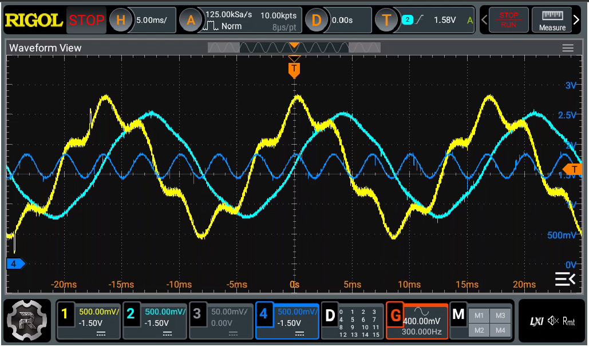
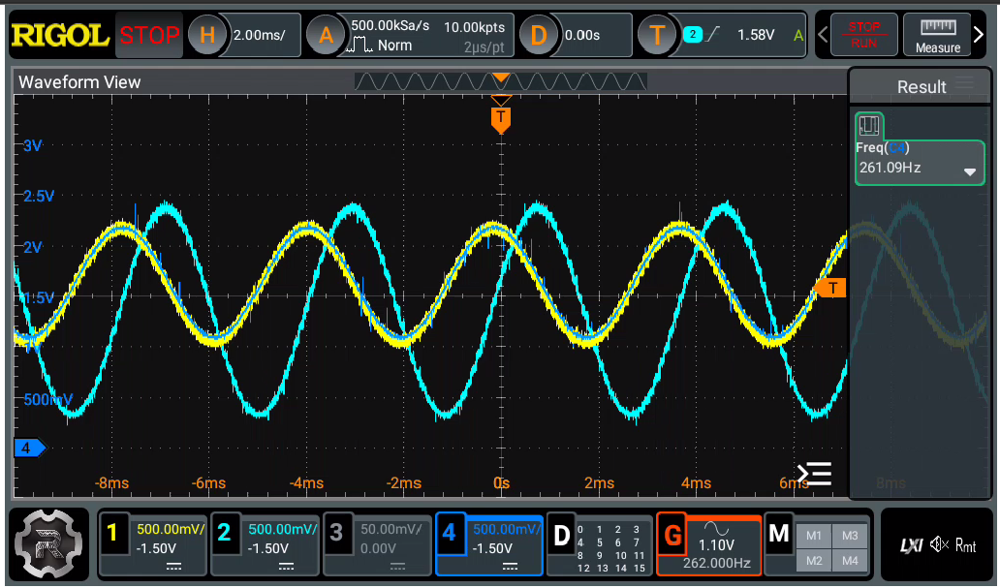
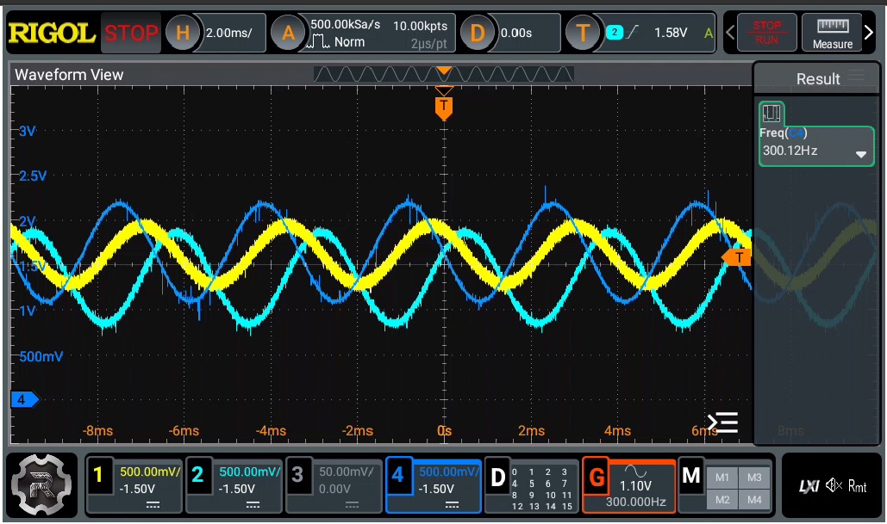

# picoHIL
Raspberry pi pico based Hardware-In-the-Loop. 
 
Este projeto consiste de: 
- Um conjunto de solvers para sistemas lineares do tipo A.x=B
- Um pequeno motor de análise nodal de circuitos (picoSPICE)
- Possibilidade de iteração com o mundo externo através de PWM como DAC e canais ADC para
interação com o circuito.
- Execução em tempo quasi-real do circuito (depende do número de nós e elementos). 
O objetivo é que o microcontrolador emule circuitos internamente, porém iteragindo com o mundo externo. 
A iteração é feita através de: 
- ADCs que servem como fontes de tensão ou corrente, com a respectiva adaptação de faixa de tensão e offset. 
- DACs via PWM+RC que servem para observar a diferença de potencial entre nós ou a corrente nos elementos.
- I/O (essencialmente input) cujo objetivo é acionar interruptores controlados (elementos SWITCH). 
O diagrama abaixo exibe a conexão com o pico2: 
 
ADC: GP26 - ADC0, GP27 - ADC1, GP28 - ADC2 
PWM: GP16 - PWM0A, GP17 - PWM0B, GP18 - PWM1A, GP18 - PWM1B 
Nos pinos de PWM foram inseridas redes R-C (2k2 e 10nF) como filtro passa-baixa (formando um PWMDAC). 
Na placa que eu desenvolvi, optei por inserir um LM358 como seguidor em cada um dos 4 filtros PB. 

# Passo-A-Passo
Para rodar o picoHIL na Raspberry pi PICO (testado apenas na pico2 por enquanto):
- Instalar do VS Code + Extensão da Raspberry Pi Pico.
- Importar o projeto.
- Compilar e descarregar na placa. 
# Exemplos de uso:
- Circuito RL com fonte senoidal interna associada à fonte externa imposta pelo sinal no ADC, corrente e tensão disponibilizadas nos PWMDAC. 
Neste exemplo duas fontes de tensão estão em série (uma senoidal de 60Hz interna e uma externa lida pelo ADC); 
Na figura abaixo o Canal 4 de azul exibe a tensão externa; o Canal 1 de amarelo exibe o resultado da associação e o Canal 2 (azul claro) exibe o valor da corrente através do indutor emulado. 
 
- Circuito RLC com fonte senoidal externa imposta pelo ADC, corrente e tensão disponibilizadas nos PWMDAC. 
Na figura abaixo o Canal 4 de azul exibe a tensão externa; o Canal 1 de amarelo a leitura da corrente através do indutor emualado e o Canal 2 (azul claro) exibe a tensão no capacitor emulado. O circuito está submetido a uma senoide bem próxima da frequencia de ressonancia. 
 
Nesta outra simulação, o circuito está com frequencia acima da de ressonância.
 

# TODO:
- Corrigir bugs. 
- Expandir para mais placas (STM32, Pico 1, TMS320F28xyz, etc). 
- Construir mais exemplos com outras fontes e outros tipos de circuitos. 

Quaisquer dúvidas: daniel.bez.ifce@gmail.com  
Boa simulação!
